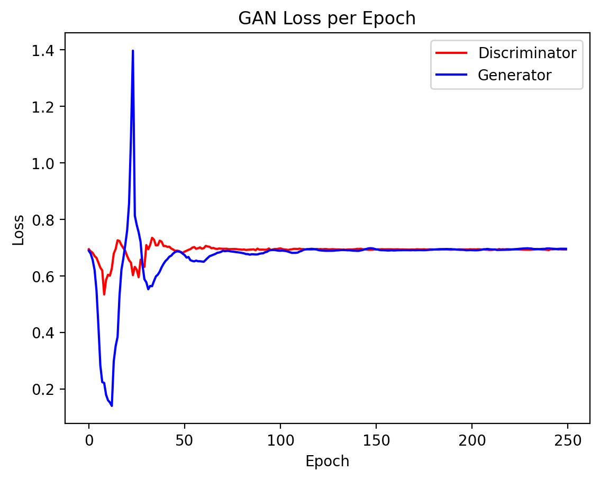
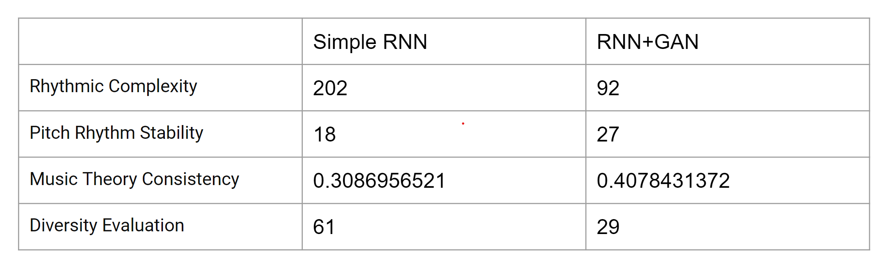

# Music Generation with Generative Adversarial Networks 

## Index
- [Project Overview](#project-overview)
- [Dataset](#dataset)
- [Taining Instructions](#training-instructions)
- [Final Result](#final-result)

## Project Overview
Our task is generating music through our model: after training based on given training midi data, the network can generate a certain length of midi data, which is shown below. The main objective is to improve the generator's capacity to create intricate and realistic musical sequences that, in the discriminator's opinion, are indistinguishable from actual compositions. This method aims to overcome the limitations of simpler RNNs and exploit the capabilities of LSTM units in handling sequence data effectively, providing a robust framework for learning and generating high-quality musical content.

## Dataset
The dataset we use is GiantMIDI-Piano, which can be downloaded from https://github.com/bytedance/GiantMIDI-Piano

## Training Instructions
It is strongly suggested that using "model_tf.ipynb" on google colab to run the project. Codes are divided into blocks according to the function and comments are written in each part to help understand. "model_local.py" is a simplified version which we use to debug and test when the "model.ipynb" is running on the colab.

If the user choose "model_tf.ipynb", here are instructions.

### Steps:

1. Download the GiantMIDI-Piano and upload it to the google drive.
2. Import the "model_tf.ipynb" to the colab.
3. Click "Run All". The authority to connect with your google drive will be requested. Select "Yes".
4. Wait until the model finishes training. All results will be printed out.

It is also acceptable if the user wants to train the model locally using "model_local.py". 

### Steps:

1. Download the GiantMIDI-Piano to a local folder.
2. Install dependencies and change related file paths.
3. Input "python3 train.py" in the terminal or click "RUN" in IDE(such as VSCode).

## Final Result
Parameters in our experiment are batchsize=128, seq_lenghth=100 and epochs=250. Adam is used for training with learning_rate=0.0001 and beta=0.5.
After training, the loss diagram is

Applying the evaluation for both our results and the results of other pure RNNs methods, we get the followings

Two demos, "piano.wav" and "mixed.wav", are offered. The first one is an audio only includes piano while the second one is a mixed version, which has the same melody but consists of different kinds of instruments. "mixer.ipynb" is the file to produce mixed audio.
